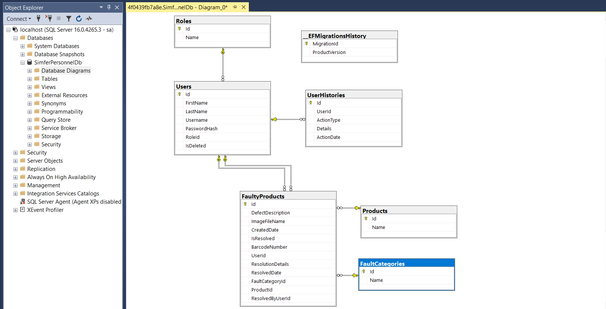
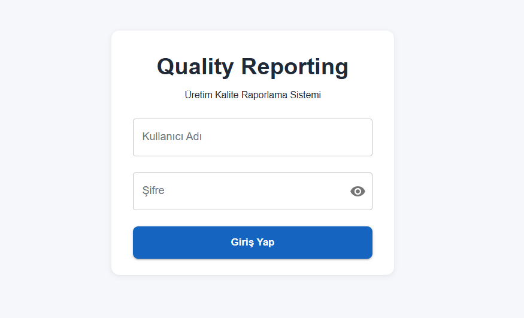
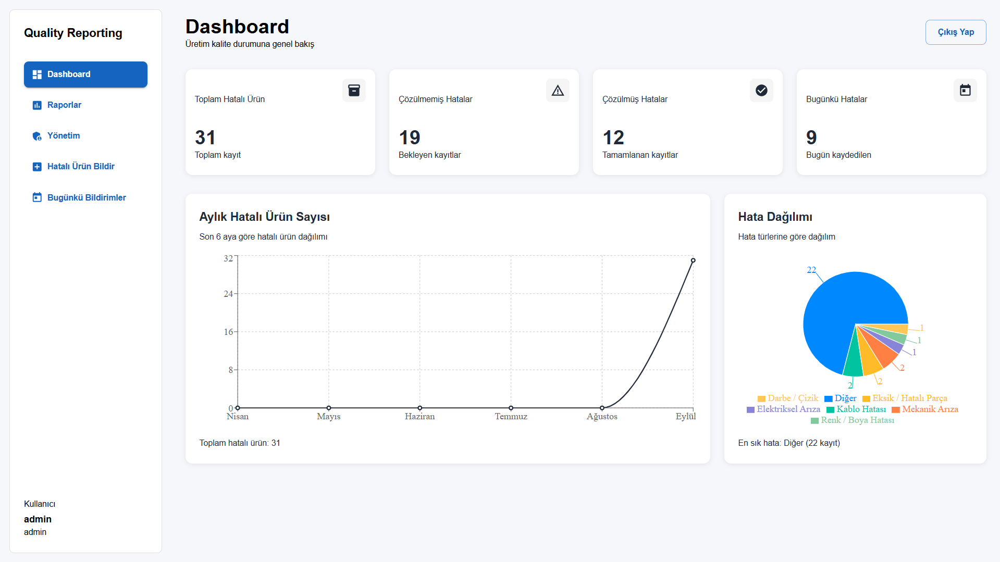
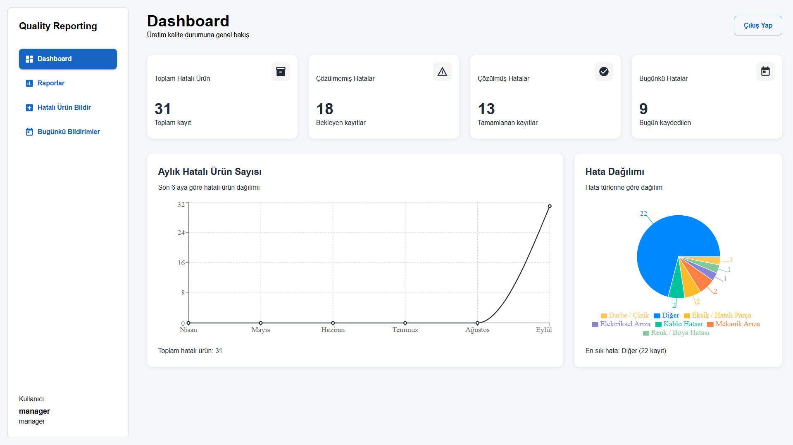
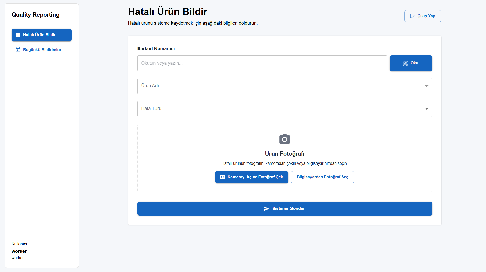

# 🏭 Quality Reporting System (Kalite Raporlama Sistemi)

Üretim hatlarındaki kalite kontrol süreçlerini dijitalleştirmek, sahadaki arıza ve uygunsuzluk bildirimlerini standartlaştırarak anlık raporlamak amacıyla geliştirilmiş uçtan uca kurumsal web ve mobil destekli yönetim sistemidir.

---

## 📌 Proje Hakkında ve Amaç

Geleneksel üretim hatlarında kağıt üzerinde veya manuel yürütülen hata bildirim süreçleri; veri kaybına, geç müdahalelere ve operasyonel verimsizliklere yol açmaktadır. 

Bu projenin temel amacı:
* **Hızlı Bildirim:** Sahadaki operatörlerin hatalı parçaları barkod okutarak ve fotoğraf ekleyerek saniyeler içinde sisteme girmesini sağlamak.
* **Uçtan Uca Takip:** Bildirilen arızaların durumunu (Bekliyor / Çözüldü), çözüm detaylarını ve müdahale eden personeli şeffaf biçimde izlemek.
* **Analitik Karar Desteği:** Yönetim kademesine aylık hata trendleri, ürün bazlı arıza dağılımları ve performans metrikleri üzerinden anlık aksiyon alma kabiliyeti kazandırmaktır.

---

## 🛠️ Kullanılan Teknolojiler ve Mimari

* **Frontend:** React, TypeScript, Material UI (MUI)
* **Backend & API:** .NET / C# Web API, Entity Framework Core
* **Veritabanı:** Microsoft SQL Server (MSSQL), Code-First Migrations
* **Mobil:** Saha Operatörü Mobil Web / Hibrit Arayüzü
* **Güvenlik & Yetki:** Role-Based Access Control (RBAC - Admin, Manager, Worker)

---

## 🗄️ Veritabanı Mimarisi

Sistem; kullanıcılar, roller, denetim kayıtları (audit log) ve hatalı ürün ilişkilerini ACID prensiplerine uygun olarak ilişkisel bir şemada yönetmektedir.

  

* **Users & Roles:** Kullanıcı kimlik doğrulama ve rol atamaları (Admin, Manager, Worker).
* **FaultyProducts:** Hata tanımı, barkod, fotoğraf dosya yolu ve çözüm detaylarını saklayan ana kayıt tablosu.
* **UserHistories:** Sistem içerisindeki kullanıcı hareketlerini takip eden loglama yapısı.

---

## 🖥️ Sistem Ekranları ve Modüller

### 1. Giriş ve Analitik Dashboard Paneli
Rol bazlı yönlendirme sunan güvenli giriş ekranı ve anlık operasyonel KPI metriklerini görselleştiren genel gösterge paneli.

| Giriş Ekranı | Dashboard (Yönetici Özeti) |
|:---:|:---:|
|  |  |
| Güvenli kimlik doğrulama arayüzü | Hata sayıları ve aylık dağılım grafikleri|

---

### 2. Gelişmiş Raporlama, Filtreleme ve Metrikler
Tarih, durum, barkod ve ürün bazında filtreleme kabiliyeti; Excel dışa aktarım desteği ve interaktif pasta/çubuk grafikler.

| Rapor Filtreleme | Veri Analitiği & Grafikler |
|:---:|:---:|
|  |  |
| Dinamik filtreleme ve Excel çıktısı | Ürün ve tarihe göre vaka dağılımı |

---

### 3. Hata Yönetimi, Kayıt Listesi ve Görsel Kanıt
Sahadan toplanan bildirimlerin durumu, fotoğraflı inceleme penceresi ve yapılan teknik müdahalenin kayıt altına alınması.

| Hata Kayıtları Tablosu | Hata Detayı (Bekleyen) | Çözüm Detayı (Onaylanan) |
|:---:|:---:|:---:|
|  |  |  |
| Dinamik durum güncelleme tablosu[cite: 7] | Fotoğraflı arıza bildirimi | Müdahale ve çözüm kaydı |

---

### 4. Hata Bildirimi ve Rol Bazlı Arayüzler (Web)
Kullanıcının rolüne göre özelleşen dinamik menüler ve kamera entegrasyonlu bildirim formu.

| Hatalı Ürün Bildirimi Formu | Günlük Bildirim Takibi |
|:---:|:---:|
|  |  |
| Barkod ve görsel yükleme alanı | Operatörün günlük bildirim özeti |

| Manager (Yönetici) Görünümü | Worker (Operatör) Görünümü |
|:---:|:---:|
|  |  |
| Yönetici yetkilerine özel menü | Yalnızca bildirim odaklı sade menü |

---

### 5. Kullanıcı ve Yetki Yönetimi
Yalnızca admin rolündeki kullanıcıların erişebildiği kullanıcı ekleme, rol belirleme ve yetkilendirme modülü.

| Kullanıcı Listesi | Yeni Kullanıcı Ekleme Modalı |
|:---:|:---:|
|  |  |
| Tanımlı personeller ve rolleri | Rol atamalı yeni personel kaydı |

---

### 6. Saha Mobil Uygulaması
Üretim hattındaki teknisyenlerin sahada hızlı hareket edebilmesi için tasarlanmış mobil bildirim, liste ve filtreleme arayüzleri.

| Mobil Arıza Bildirimi | Mobil Arıza Takip Listesi | Mobil Filtreleme |
|:---:|:---:|:---:|
|  |  |  |
| Barkod okutma ve kamera entegrasyonu[cite: 17] | Tek tıkla durum güncelleme[cite: 18] | Çok kriterli arama ve sıralama |

---

## 👥 Geliştirici Ekip

* **Celil Gündoğan**
* **İhsan Öztürk**